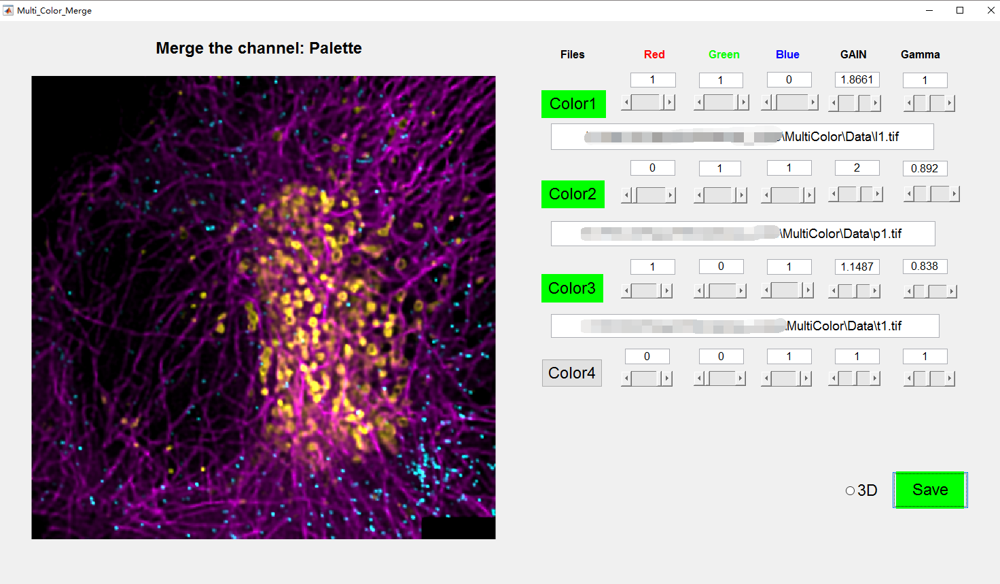

# Merge Channel: A tool for multi-color 2D or 3D imaging

    

#### This tool can adjust the three color channel component (RGB), the GAIN (the brightness to display) and also the gamma to adjust the histogram to make images more 'naturally'.
###It will be extended to 7 color channels in future !